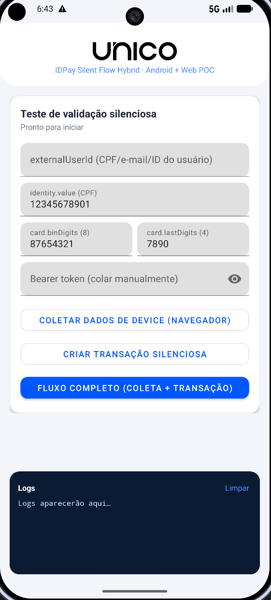

<p align="center">
  <a href="https://unico.io">
    
  </a>
</p>

<h1 align="center">IDPay Silent Flow Hybrid — Android + Web POC</h1>

<div align="center">

### POC de validação silenciosa de transações — app nativo abre Custom Tabs e a coleta de dados de device acontece via página web


</div>

---

## 🎯 O que esta POC faz

Cenário: um app **nativo** abre uma página web em **Custom Tabs**, e é nessa página que acontece a coleta de dados de device:

1. O app abre a página `collect-page/` em **Custom Tabs**, passando o `externalUserId` na URL. A única fricção visível é uma tela de loading.
2. A página roda a **SDK Web** da Unico em modo silencioso: `setSilentInfo(externalUserId)` + `prepareSelfieCamera` — **sem abrir a câmera**. A coleta de device sai em background; a página aguarda a janela de envio (5s) e devolve o controle ao app via deep link (`silentflowhybrid://done`).
3. O app cria uma transação no IDPay (`POST /api/public/v1/credit/transaction`) com o **mesmo `externalUserId`** em `additionalInfo.externalUserID`. Em uma integração real essa chamada é feita pelo **backend do cliente** (server-to-server) — a POC encurta esse caminho chamando a API diretamente.
4. Resultado:
   - `status: approved` → **aprovação silenciosa**, sem nenhuma fricção adicional (tela verde);
   - senão → o app abre o `link` de challenge automaticamente (Custom Tabs) e recebe o retorno via deep link.

O botão **Fluxo completo** roda tudo em sequência. A página de coleta é **estática** — sem npm, sem build: o bundle da SDK Web (`UnicoCheckBuilder.min.js`) está no repositório, no mesmo padrão da [POC vanilla](https://github.com/unico-labs/unico-sdk-poc-js-vanilla).

<p align="center">
  
</p>

> ⚠️ **Host da página**: a SDK Web valida o host **real** da página contra os hosts registrados na SDK Key e exige um contexto seguro do browser — em HTTP puro, só `localhost` funciona; qualquer outro host exige **HTTPS**. Por isso o teste local usa `localhost` + `adb reverse` (passo a passo abaixo).
>
> ⚠️ O `externalUserId` da coleta e o `additionalInfo.externalUserID` da transação precisam ser **idênticos, char a char**.
>
> ⚠️ A coleta tem **validade máxima de 5 minutos**: a transação precisa ser criada dentro dessa janela. As primeiras transações de um `externalUserId` retornam challenge — a aprovação silenciosa depende de histórico prévio no **mesmo device**.

---

## 💻 Compatibilidade

- **Android:** 7.0 (API nível 24) ou superior
- **Kotlin:** 2.2
- Qualquer servidor de arquivos estáticos para a página (ex.: `python3 -m http.server`)

---

## ⚙️ Configuração antes de rodar

Este repositório **não contém nenhuma credencial real**. Substitua os placeholders:

| Onde | O que trocar | Valor |
| --- | --- | --- |
| `collect-page/config.js` | `SDK_KEY` | Sua **SDK Key Web** (by client), registrada para o host da página e com o envio de `silentInfo` habilitado |
| `app/.../PocConfig.kt` | `COMPANY_ID` | O UUID da sua company no IDPay |
| `app/.../PocConfig.kt` | `COLLECT_PAGE_URL` | Onde a página está servida (default `http://localhost:3000`) |

O **access token (Bearer)** **não é hardcoded** — cole-o no campo "Bearer token" da tela antes de rodar, já que costuma ter validade curta.

Para gerar as credenciais Unico, consulte a [documentação oficial](https://developer.unico.io/).

---

## ▶️ Rodando o teste (local)

**1. Sirva a página de coleta** (na raiz do repositório):

```bash
cd collect-page
python3 -m http.server 3000
```

**2. Túnel adb** (com o emulador/device conectado) — faz o `localhost:3000` do device apontar para a sua máquina:

```bash
adb reverse tcp:3000 tcp:3000
```

> Refaça este comando se o device/emulador reiniciar. Ele é necessário porque a
> SDK Key local é registrada para `localhost` — o único host que o browser
> considera seguro sem HTTPS.

**3. Instale e abra o app** (Android Studio ▶ ou `./gradlew installDebug`).

**4. Teste**: preencha os campos (ou mantenha os exemplos), cole o Bearer token e toque em **Fluxo completo** — Custom Tab com loading → retorno automático → transação → **Aprovado!** ou challenge.

Smoke test da página sem o app: abra `http://localhost:3000/?externalUserId=teste` no browser do desktop e confira o painel de debug no rodapé.

---

## 📁 Estrutura

```
app/            # App Android nativo (abre a página e cria a transação)
collect-page/   # Página estática de coleta (SDK Web em modo silencioso)
  index.html    # Loading + retorno ao app
  collect.js    # setSilentInfo + prepare (sem open) + grace + deep link
  config.js     # SDK Key, ambiente, use case, deep link, grace
  UnicoCheckBuilder.min.js  # Bundle da SDK Web (padrão da POC vanilla)
  models/ resources/        # Assets da SDK Web
```

Em produção, a `collect-page/` é hospedada em um domínio **HTTPS** registrado na SDK Key (do cliente ou da Unico) — o app só troca a `COLLECT_PAGE_URL` e o `adb reverse` deixa de existir.
