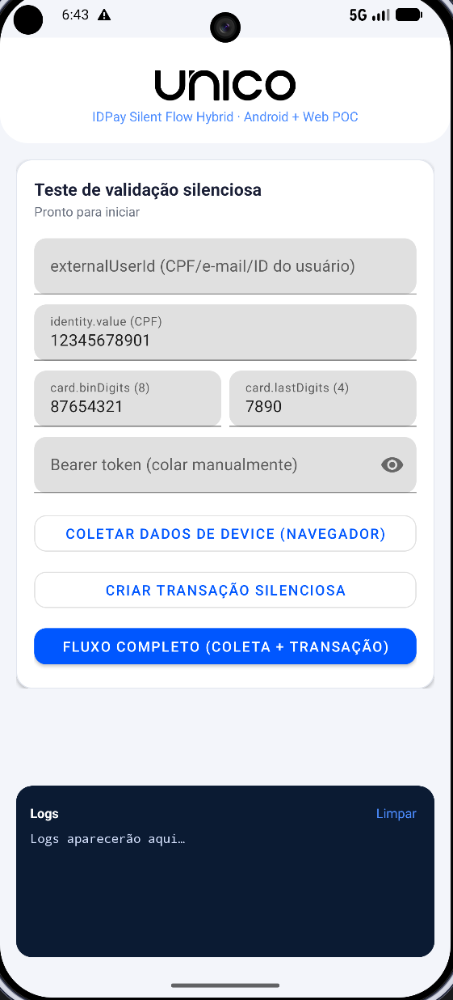

<p align="center">
  <a href="https://unico.io">
    
  </a>
</p>

<h1 align="center">IDPay Silent Flow Hybrid — Android + Web POC</h1>

<div align="center">

### Silent transaction validation POC — a native app opens Custom Tabs and the device data collection happens on a web page


</div>

---

## 🎯 What this POC does

Scenario: a **native** app opens a web page in **Custom Tabs**, and the device data collection happens on that page:

1. The app opens the `collect-page/` in **Custom Tabs**, passing the `externalUserId` in the URL. The only visible friction is a loading screen.
2. The page runs the Unico **Web SDK** in silent mode: `setSilentInfo(externalUserId)` + `prepareSelfieCamera` — **the camera is never opened**. After the prepare resolves, the page waits `POST_PREPARE_WAIT_MS` (2.5s) and returns to the app via deep link (`silentflowhybrid://done`). See **Timing** below.
3. The app creates an IDPay transaction (`POST /api/public/v1/credit/transaction`) with the **same `externalUserId`** in `additionalInfo.externalUserID`. In a real integration this request is made by the **client's backend** (server-to-server) — the POC shortcuts that hop and calls the API directly.
4. Result:
   - `status: approved` → **silent approval**, with no additional friction (green screen);
   - otherwise → the app automatically opens the challenge `link` (Custom Tabs) and receives the return via deep link.

The **"Fluxo completo"** (full flow) button runs everything in sequence. The collect page is **static** — no npm, no build step: the Web SDK bundle (`UnicoCheckBuilder.min.js`) is committed to the repository, following the same pattern as the [vanilla POC](https://github.com/unico-labs/unico-sdk-poc-js-vanilla).

<p align="center">
  
</p>

> ⚠️ **Page host**: the Web SDK validates the page's **real** host against the hosts registered for the SDK Key, and requires a browser secure context — over plain HTTP, only `localhost` qualifies; any other host requires **HTTPS**. That is why local testing uses `localhost` + `adb reverse` (step by step below).
>
> ⚠️ The `externalUserId` used in the collection and the `additionalInfo.externalUserID` sent in the transaction must be **identical, character by character**.
>
> ⚠️ The collection is **valid for at most 5 minutes**: the transaction must be created within that window. The first transactions of a given `externalUserId` return a challenge — silent approval depends on prior history on the **same device**.

---

## 💻 Compatibility

- **Android:** 7.0 (API level 24) or higher
- **Kotlin:** 2.2
- Any static file server for the page (e.g. `python3 -m http.server`)

---

## ⚙️ Setup before running

This repository **contains no real credentials**. Replace the placeholders:

| Where | What to replace | Value |
| --- | --- | --- |
| `collect-page/config.js` | `SDK_KEY` | Your **Web SDK Key** (by client mode), registered for the page host and with `silentInfo` sending enabled |
| `app/.../PocConfig.kt` | `COMPANY_ID` | Your IDPay company UUID |
| `app/.../PocConfig.kt` | `COLLECT_PAGE_URL` | Where the page is served (default `http://localhost:3000`) |

The **access token (Bearer)** is **not hardcoded** — paste it into the "Bearer token" field on the screen before running, since it usually has a short lifetime.

To generate Unico credentials, see the [official documentation](https://developer.unico.io/).

---

## ⏱️ Timing

Count the wait **after the `prepareSelfieCamera` promise resolves**. From that
point, allow **at least 2.5 seconds** before creating the transaction:

- **~1.5s** for the collection to be sent from the Custom Tab (the page must
  stay open during this part);
- the remaining **~1s** for the collection to be processed and become
  available to the transaction validation.

The POC implements this as a single wait on the page
(`collect-page/config.js → POST_PREPARE_WAIT_MS`, default 2500ms).

The user can wait less if the collection is triggered **earlier in the
journey** (e.g. when entering the payment screen instead of at the confirm
tap) — a collection stays **valid for 5 minutes** after it is generated.

With these numbers, the full episode (open tab → back in the app) takes
**3 to 5 seconds**, depending on device, network and other factors.

---

## ▶️ Running the test (local)

**1. Serve the collect page** (from the repository root):

```bash
cd collect-page
python3 serve.py   # static server with caching disabled (port 3000)
```

**2. adb tunnel** (with the emulator/device connected) — makes the device's `localhost:3000` point to your machine:

```bash
adb reverse tcp:3000 tcp:3000
```

> Run this command again if the device/emulator restarts. It is needed because
> the local SDK Key is registered for `localhost` — the only host the browser
> treats as secure without HTTPS.

**3. Install and open the app** (Android Studio ▶ or `./gradlew installDebug`).

**4. Test**: fill in the fields (or keep the examples), paste the Bearer token and tap **"Fluxo completo"** (full flow) — Custom Tab with loading → automatic return → transaction → **approved** (green screen) or challenge.

Smoke test of the page without the app: open `http://localhost:3000/?externalUserId=test` in your desktop browser and check the debug panel at the bottom.

---

## 📁 Structure

```
app/            # Native Android app (opens the page and creates the transaction)
collect-page/   # Static collect page (Web SDK in silent mode)
  index.html    # Loading + return to the app
  collect.js    # setSilentInfo + prepare (no open) + deep link back to the app
  config.js     # SDK Key, environment, use case, deep link
  serve.py      # local static server with caching disabled
  UnicoCheckBuilder.min.js  # Web SDK bundle (same pattern as the vanilla POC)
```

> The silent flow does not need the SDK's additional resources (the FaceTec
> files and models from step 4 of the installation guide) — those are only
> required when the camera is opened for a capture journey.

In production, the `collect-page/` is hosted on an **HTTPS** domain registered for the SDK Key (owned by the client or by Unico) — the app just changes `COLLECT_PAGE_URL`, and the `adb reverse` step goes away.
